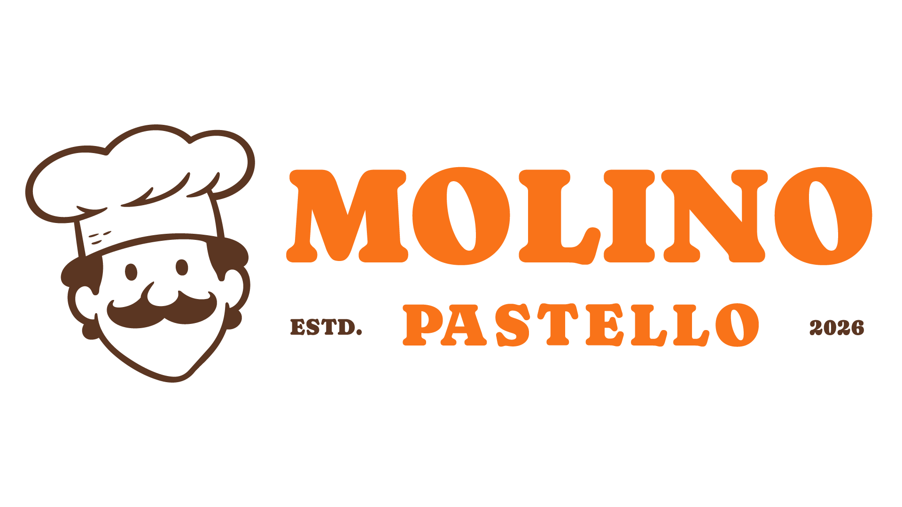

# Molino Pastello

<p align="center">
  
</p>

> A premium, full-stack Italian pasta storefront built to showcase polished ecommerce UX, secure checkout flows, role-based dashboards, and a scalable commerce foundation.

[](https://www.typescriptlang.org/)
[](https://react.dev/)
[](https://tanstack.com/start)
[](https://workers.cloudflare.com/)

<p align="center">
  <a href="#features">Features</a> ·
  <a href="#tech-stack">Tech stack</a> ·
  <a href="#quick-start">Quick start</a> ·
  <a href="#testing">Testing</a> ·
  <a href="#deployment">Deployment</a> ·
  <a href="#socials">Socials</a>
</p>

> Replace the links below once deployed.

[Live site](https://your-domain.com) · [Portfolio](https://your-portfolio.com) · [Report a bug](https://github.com/your-username/molino-pastello/issues) · [Request a feature](https://github.com/your-username/molino-pastello/issues)

## Overview

Molino Pastello brings an editorial Italian-food visual language to a modern ecommerce experience. Customers can browse live catalogue inventory, check out securely with Razorpay, receive a branded order receipt, manage delivery details, and view their account dashboard. Administrators have a protected dashboard for catalogue and inventory management.

The project is intentionally structured around domain features—catalogue, profiles, analytics, and payments—so it can grow from a showcase into a real store.

## Screenshots

Add exported screenshots to `docs/screenshots/` and replace the placeholder paths below.

| Home | Shop |
| --- | --- |
|  |  |

| Product details | Customer dashboard |
| --- | --- |
|  |  |

| Admin dashboard | Checkout |
| --- | --- |
|  |  |

## Features

### Storefront

- Editorial, responsive homepage, shop, product, about, recipe, legal, cart, and checkout pages.
- Brand-consistent responsive imagery, motion, navigation, accessible controls, and semantic headings.
- Database-driven product availability with clear sold-out states.
- Search, categories, filters, product details, reviews, recipes, and purchase paths.
- Unique metadata on public marketing pages with descriptive titles and meta descriptions.

### Identity and roles

- Clerk-powered email/password and Google authentication.
- Role-aware routes and dashboards for customers and the administrator.
- Profile details, saved delivery information, verified phone workflow, and account settings.

### Ecommerce and orders

- Razorpay INR checkout with server-created orders and server-side HMAC payment verification.
- Atomic Neon/Postgres finalization for inventory, payment, order status, and inventory movements.
- Signed Razorpay webhook endpoint for recovery when a browser closes after payment.
- Delivery/tracking view and real-time dashboard order data.
- Branded transactional receipt emails through Resend.

### Admin operations

- Catalogue creation, editing, deletion, price updates, and inventory adjustments.
- Live order, customer, product, sales, and inventory analytics.
- Charts built with Recharts and a responsive dashboard UI.

## Tech stack

| Area | Tools |
| --- | --- |
| Framework | TanStack Start, TanStack Router, React 19, TypeScript |
| Styling | Tailwind CSS, shadcn/ui patterns, Radix UI, Lucide icons, GSAP |
| Authentication | Clerk |
| Database | Neon Postgres, Drizzle ORM |
| Payments | Razorpay |
| Email | Resend |
| Charts | Recharts |
| Quality | Vitest, Biome, TypeScript, Chrome DevTools, Lighthouse |
| Hosting | Cloudflare Workers, Wrangler |

## Architecture

```text
Browser
  └─ TanStack Start routes and shared UI
       ├─ Clerk authentication and role checks
       ├─ Feature services
       │    ├─ Catalogue and inventory
       │    ├─ Profiles
       │    ├─ Analytics
       │    └─ Payments and orders
       ├─ Neon Postgres via Drizzle / serverless driver
       ├─ Razorpay checkout + signed webhook
       └─ Resend transactional receipts
```

The backend keeps business rules server-side. Prices and inventory are read from the database, Razorpay signatures are verified on the server, and payment finalization is idempotent to protect against duplicate browser callbacks or webhook retries.

## Quick start

### Prerequisites

- Node.js 22+
- npm
- A Neon Postgres database
- Clerk application keys
- Razorpay test keys
- Resend API key for receipts

### Install

```bash
git clone https://github.com/your-username/molino-pastello.git
cd molino-pastello
npm install
cp .env.example .env.local
```

Fill in `.env.local` with your own values. Never commit this file.

```env
DATABASE_URL=
VITE_CLERK_PUBLISHABLE_KEY=
CLERK_SECRET_KEY=
VITE_RAZORPAY_KEY_ID=
RAZORPAY_KEY_SECRET=
RAZORPAY_WEBHOOK_SECRET=
RESEND_API_KEY=
EMAIL_FROM="Molino Pastello <orders@your-domain.com>"
APP_URL=http://localhost:3000
```

Start development:

```bash
npm run dev
```

Visit [http://localhost:3000](http://localhost:3000).

## Database commands

```bash
npm run db:generate      # Generate Drizzle migration files
npm run db:migrate       # Apply migrations
npm run db:studio        # Open Drizzle Studio
npm run db:seed:catalog  # Seed the product catalogue
```

See [commerce system design](docs/commerce-catalog-system-design.md), [profile system design](docs/profile-persistence-system-design.md), and [transactional email guide](docs/transactional-order-email.md) for the implementation notes.

## Testing

```bash
npm test
npx tsc --noEmit
npm run build
```

The test suite is in a dedicated `tests/` directory:

```text
tests/
├── unit/          # Payment and catalogue business rules
└── integration/   # Mocked Neon transaction boundary tests
```

Tests mock external boundaries, so they never charge Razorpay, email customers, or mutate your real Neon database.

## Quality standards

Every feature change should meet these checks:

- Mobile-first layout review at 375px, tablet, and desktop widths.
- Semantic landmarks, one primary `h1`, labels, focus states, keyboard support, and descriptive alt text.
- Unique metadata for public pages and `noindex` on private or transactional routes.
- Chrome DevTools review for console errors, accessibility, SEO, responsive layout, Core Web Vitals, and layout shift.
- `npm test`, `npx tsc --noEmit`, and `npm run build` must pass.

## Deployment

This application is configured for Cloudflare Workers.

```bash
npx wrangler login
npm run deploy
```

After the first deployment, set production secrets in Cloudflare Workers:

```bash
npx wrangler secret put DATABASE_URL
npx wrangler secret put CLERK_SECRET_KEY
npx wrangler secret put RAZORPAY_KEY_SECRET
npx wrangler secret put RAZORPAY_WEBHOOK_SECRET
npx wrangler secret put RESEND_API_KEY
npx wrangler secret put EMAIL_FROM
npx wrangler secret put APP_URL
```

Then configure Razorpay’s `payment.captured` and `order.paid` webhook events to:

```text
https://your-domain.com/api/razorpay-webhook
```

For production receipts, verify a sending domain in Resend and remove any local-only `EMAIL_TO` override.

## Roadmap

- [ ] Public production domain and absolute canonical/social metadata
- [ ] Isolated Neon staging database and live webhook integration tests
- [ ] Persistent cart and inventory reservation expiry
- [ ] Refund, cancellation, tax, coupon, and invoice workflows
- [ ] Shipping carrier integration and live delivery events
- [ ] Rate limiting, error monitoring, backups, and production observability

## Socials

Replace these placeholders with your own handles before publishing.

[](https://github.com/your-username)
[](https://www.linkedin.com/in/your-handle/)
[](https://instagram.com/your-handle)
[](https://x.com/your-handle)
[](mailto:contact@yourdomain.com)

## License

This project is currently private and intended as a portfolio and ecommerce showcase. Add a license before distributing or accepting external contributions.

---

Crafted with care by **Saquib Hazari** · [Portfolio](https://your-portfolio.com) · [LinkedIn](https://www.linkedin.com/in/your-handle/)
